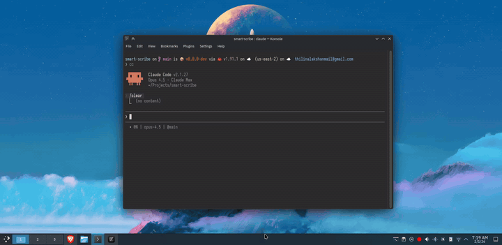

```
 ___                      _  ___           _  _
/ __|_ __  __ _ _ _ ___ _| |/ __| __  _ _ |_|| |__   ___
\__ \ '  \/ _` | '_|  _|  _|\__ \/ _|| '_|| || '_ \ / -_)
|___/_|_|_\__,_|_|  \__|_|  |___/\__||_|  |_||_.__/ \___|
```

[](https://github.com/ThilinaTLM/smart-scribe/actions/workflows/ci.yml)
[](https://github.com/ThilinaTLM/smart-scribe/releases)
[]()
[](https://www.rust-lang.org/)
[](LICENSE)

AI-powered voice-to-text for Linux, macOS, and Windows. Record from your microphone and get accurate transcriptions using your ChatGPT subscription (OAuth) or an OpenAI API key.

<p align="center">
  
</p>

## Install

**Linux / macOS:**

```bash
curl -sSL https://raw.githubusercontent.com/ThilinaTLM/smart-scribe/main/scripts/install.sh | bash
```

**Windows (PowerShell):**

```powershell
irm https://raw.githubusercontent.com/ThilinaTLM/smart-scribe/main/scripts/install.ps1 | iex
```

The install scripts automatically detect fresh installs, updates, and reinstalls.

## Quick Start

### ChatGPT OAuth (default — uses your Plus/Pro subscription)

```bash
smart-scribe login          # opens a browser, persists token at <config_dir>/smart-scribe/oauth.json
smart-scribe -d 10s         # record and transcribe
smart-scribe auth status    # see current auth state
```

You can sign out at any time with `smart-scribe logout`. The token is refreshed automatically before each request.

If you already use OpenAI's Codex CLI, you can skip the browser step:

```bash
smart-scribe login --from-codex
```

This imports the refresh token from `~/.codex/auth.json` and rotates it under our own store. **Note:** rotating the refresh token invalidates Codex's copy, so you will need to re-run `codex login` once afterwards.

### OpenAI API key (metered)

```bash
smart-scribe config set auth api_key
export OPENAI_API_KEY=sk-...          # or: smart-scribe config set openai_api_key sk-...
smart-scribe -d 10s
```

The API path uses `gpt-4o-mini-transcribe` by default — change with:

```bash
smart-scribe config set openai_transcribe_model whisper-1
```

## Auth modes

| Mode      | Endpoint                                  | Credential         | Billing                          |
| --------- | ----------------------------------------- | ------------------ | -------------------------------- |
| `oauth`   | `chatgpt.com/backend-api/transcribe`      | OAuth Bearer token | Counts against ChatGPT subscription |
| `api_key` | `api.openai.com/v1/audio/transcriptions`  | `OPENAI_API_KEY`   | Metered per-minute API usage    |

> **Note on OAuth:** smart-scribe authenticates against `auth.openai.com` using the public OpenAI Codex CLI OAuth client. OpenAI has not (yet) opened that client registry to third parties, so the browser consent screen will show "Codex CLI". This is the same approach used by community tools like `term-llm`, `openhands`, and others. If OpenAI tightens the policy in the future the `api_key` path will continue to work.

## Features

- **Voice-to-text** — record audio, get clean text
- **Two auth modes** — ChatGPT subscription via OAuth or OpenAI API key
- **Clipboard integration** — copy transcriptions directly (`-c`)
- **Keystroke output** — type into focused window (`-k`)
- **Desktop notifications** — get notified when done (`-n`)
- **Audio cues** — audible beeps when recording starts/stops (`-a`)
- **Daemon mode** — background service for hotkey integration

### Platform Support

| Feature         |    Linux     |    macOS    |  Windows   |
| --------------- | :----------: | :---------: | :--------: |
| Audio Recording |     cpal     |    cpal     |    cpal    |
| Clipboard       |   arboard    |   arboard   |  arboard   |
| Keystroke       | configurable |   native    |   native   |
| Notifications   | notify-rust  |   native    |   native   |
| Daemon Mode     | Unix socket  | Unix socket | Named pipe |

Linux keystroke: `enigo` (default) or native tools via `--keystroke-tool`.

## Usage

### One-Shot Mode

Record for a fixed duration:

```bash
smart-scribe                     # 10s recording, output to stdout
smart-scribe -d 30s              # 30 second recording
smart-scribe -d 1m -c            # 1 minute, copy to clipboard
smart-scribe -d 2m -k            # 2 minutes, type result
smart-scribe -c -k -n            # Clipboard + keystroke + notify
smart-scribe --output json       # Machine-readable one-shot output
```

### Daemon Mode

Run as a background service (ideal for hotkey integration):

```bash
# Start daemon
smart-scribe --daemon -c -n      # With clipboard + notifications

# Control daemon
smart-scribe daemon toggle       # Start/stop recording
smart-scribe daemon cancel       # Cancel current recording
smart-scribe daemon status       # Show state (idle/recording/processing)
smart-scribe --output json daemon status
smart-scribe --output json daemon subscribe   # Stream daemon events as NDJSON
```

Bind `smart-scribe daemon toggle` to a hotkey for push-to-talk.

### JSON Output

Use `--output json` when another program needs structured output.

**One-shot result:**

```bash
smart-scribe --output json -d 10s
```

Example stdout:

```json
{"ok":true,"mode":"oneshot","text":"hello world","audio_size":"84 KB","clipboard_copied":false,"keystroke_sent":false,"paste_sent":false}
```

**Daemon status:**

```bash
smart-scribe --output json daemon status
```

Example stdout:

```json
{"ok":true,"command":"status","state":"recording","elapsed_ms":1532}
```

**Daemon event stream:**

```bash
smart-scribe --output json daemon subscribe
```

This emits newline-delimited JSON (NDJSON / JSONL), for example:

```json
{"type":"state","state":"recording","elapsed_ms":1500}
{"type":"result","text":"hello world","audio_size":"84 KB","clipboard_copied":false,"keystroke_sent":false,"paste_sent":false}
```

If you start the daemon itself with `--output json`, completed transcriptions written by the daemon process are also emitted as JSON instead of bare text.

## Configuration

```bash
smart-scribe config init                              # Create config with defaults
smart-scribe config set auth oauth                    # Use ChatGPT subscription (default)
smart-scribe config set auth api_key                  # Use OpenAI API key
smart-scribe config set openai_api_key sk-...         # Persist key in config (or use OPENAI_API_KEY env)
smart-scribe config set openai_transcribe_model whisper-1
smart-scribe config list                              # Show all settings
smart-scribe config path                              # Show config file location
```

**Config file:**

- Linux: `~/.config/smart-scribe/config.toml`
- macOS: `~/Library/Application Support/smart-scribe/config.toml`
- Windows: `%APPDATA%\smart-scribe\config.toml`

**OAuth token file:** sibling `oauth.json` in the same directory (mode 0600 on Unix; managed by `smart-scribe login` / `logout`).

**Priority:** CLI args > environment variables > config file > defaults

### CLI Options

| Option                          | Description                          | Default |
| ------------------------------- | ------------------------------------ | ------- |
| `--output <FORMAT>`             | Output format (`text`, `json`)       | text    |
| `-d, --duration <TIME>`         | Recording duration (10s, 1m, 2m30s)  | 10s     |
| `-c, --clipboard`               | Copy to clipboard                    | off     |
| `-k, --keystroke`               | Type into focused window             | off     |
| `--keystroke-tool <TOOL>`       | Keystroke tool (Linux only)          | enigo   |
| `-n, --notify`                  | Desktop notifications                | off     |
| `-a, --audio-cue`               | Play audio cues on recording events  | off     |
| `--daemon`                      | Run in daemon mode                   | off     |
| `--max-duration <TIME>`         | Max recording (daemon safety limit)  | 60s     |
| `-p, --paste`                   | Smart paste (Linux/KDE Wayland)      | off     |
| `--indicator`                   | Show recording indicator (daemon)    | off     |
| `--indicator-position <POS>`    | Position of indicator (Linux only)   | top-right |

### Subcommands

| Command                       | Description                                       |
| ----------------------------- | ------------------------------------------------- |
| `smart-scribe login`          | Open browser, run OAuth flow, store token         |
| `smart-scribe login --from-codex` | Import refresh token from existing Codex install |
| `smart-scribe logout`         | Delete OAuth token                                |
| `smart-scribe auth status`    | Print current auth mode & token state             |
| `smart-scribe config <...>`   | Manage configuration                              |
| `smart-scribe daemon <...>`   | Control the running daemon                        |

<details>
<summary><strong>Platform Notes</strong></summary>

### Linux

Optional dependencies for specific features:

| Feature          | Options (any one)                       |
| ---------------- | --------------------------------------- |
| Keystroke (`-k`) | ydotool, wtype (Wayland), xdotool (X11) |

**Keystroke tool selection:**

By default, SmartScribe uses `enigo` (cross-platform library). On Linux, you can choose a specific tool:

| Tool      | Description                                    |
| --------- | ---------------------------------------------- |
| `enigo`   | Cross-platform library (default)               |
| `auto`    | Auto-detect: ydotool > wtype > xdotool > enigo |
| `ydotool` | Works on both Wayland and X11 (needs daemon)   |
| `wtype`   | Wayland-native                                 |
| `xdotool` | X11-only                                       |

```bash
smart-scribe -k --keystroke-tool auto
smart-scribe -k --keystroke-tool xdotool

# Via config (persistent)
smart-scribe config set linux.keystroke_tool auto
```

**Install keystroke tools:**

```bash
# Arch Linux
sudo pacman -S xdotool   # or ydotool for Wayland

# Ubuntu/Debian
sudo apt install xdotool

# Fedora
sudo dnf install xdotool
```

### macOS

No additional dependencies required. All features use native APIs.

### Windows

No additional dependencies required. All features use native APIs.

</details>

## Building from Source

Requires [Rust](https://rustup.rs/) 1.70+

```bash
git clone https://github.com/ThilinaTLM/smart-scribe.git
cd smart-scribe
cargo build --release
sudo cp target/release/smart-scribe /usr/local/bin/
```

<details>
<summary><strong>Build Dependencies</strong></summary>

| Platform | Dependencies                                                         |
| -------- | -------------------------------------------------------------------- |
| Linux    | `libasound2-dev`, `libxdo-dev`, `libxkbcommon-dev`, `libwayland-dev` |
| macOS    | None                                                                 |
| Windows  | None                                                                 |

</details>

## License

MIT
